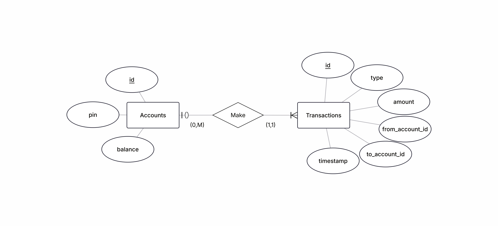

# Bank Of CLI
A functional banking application that runs entirely within the terminal. This project implements a simple command-line interface backed by a persistent database, applying Java, SQL, and Agile development practices.

## Entity Relationship Diagram

## Tech Stack

- Java
- SQL
- PostgreSQL

## Status

🚧 In development

## Setup

_Instructions coming soon_

## Features

_To be added as development progresses_